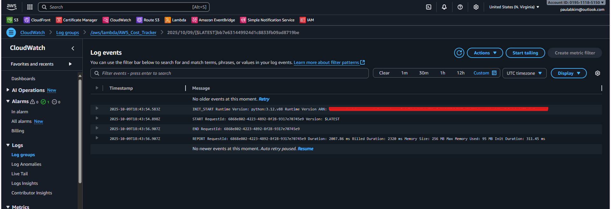
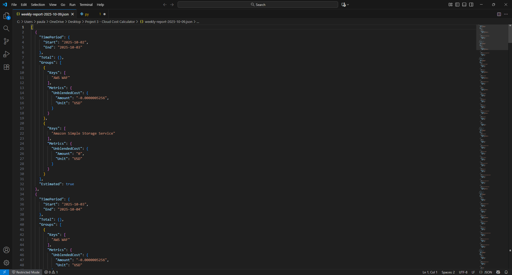
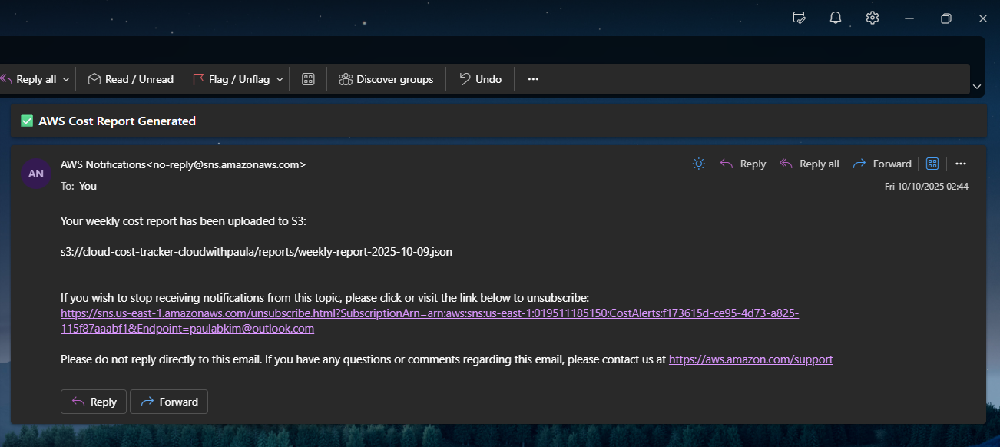

# AWS Cloud Cost Calculator with Lambda, S3, SNS, EventBridge, and CloudWatch

This project demonstrates how to automate **AWS cost tracking, reporting, and alerting** using serverless AWS services under the **Free Tier**.  
It includes **weekly report generation**, **cost alerts**, and **automated scheduling** with EventBridge.

---

## Architecture Overview


>The system operates without manual intervention. Once deployed, it retrieves cost data, generates reports, and sends notifications automatically.

---

## AWS Services Used

- **AWS Lambda** – Retrieves AWS cost data from Cost Explorer, generates weekly cost reports, and sends SNS alerts  
- **Amazon S3** – Stores generated reports in `/reports/` folder  
- **Amazon SNS (Simple Notification Service)** – Sends email notifications when reports are uploaded or when billing thresholds are exceeded  
- **Amazon EventBridge** – Schedules Lambda execution on a weekly basis (every 7 days)  
- **Amazon CloudWatch** – Monitors billing metrics and triggers alerts when total estimated charges exceed the threshold  
- **AWS Cost Explorer** – Provides granular billing and usage data for the report  

---

## Step-by-Step Setup Summary

### 1️⃣ Create an S3 Bucket
- Name: `cloud-cost-tracker-cloudwithpaula`
- Create folder: `/reports/`
- Ensure the **Lambda IAM role** has `s3:PutObject` permissions

---

### 2️⃣ Create an SNS Topic
- Topic name: `CostAlerts`
- Add an **email subscription** and confirm via your inbox  
- Note down the **Topic ARN** for Lambda environment variable configuration

---

### 3️⃣ Create the Lambda Function
- Function name: `AWS_Cost_Tracker`
- Runtime: **Python 3.12**
- Memory: **256 MB**, Timeout: **30 seconds**
- Upload file: `lambda_function.py`
- Attach IAM role with the following permissions:
  - **Inline policies:**
    - `AllowCostExplorerAccess` → grants `ce:GetCostAndUsage`
    - `AllowSNSPublish` → grants `sns:Publish`
  - **AWS managed policies:**
    - `AmazonS3FullAccess` → allows S3 report upload (`s3:PutObject`)
    - `AmazonSNSFullAccess` → enables SNS notifications
    - `AWSLambdaBasicExecutionRole` → allows CloudWatch logging
- Add environment variables:
  - `S3_BUCKET = cloud-cost-tracker-cloudwithpaula`
  - `SNS_TOPIC_ARN = arn:aws:sns:REGION:ACCOUNT_ID:CostAlerts`
- Test manually:
  - Verify report uploads to S3
  - Confirm SNS email notification is received

---

### 4️⃣ Create an EventBridge Rule
- Rule name: `WeeklyCostReportTrigger`
- Schedule: **Fixed rate of 7 days**
- Target: `AWS_Cost_Tracker` Lambda function
- Event bus: `default`
- Ensure EventBridge → Lambda invocation permissions are auto-granted

---

### 5️⃣ Configure CloudWatch Billing Alarm
- Metric: `Billing → Total Estimated Charge → EstimatedCharges`
- Threshold: `$5` (demo)
- Action: Send notification to SNS topic `CostAlerts`
- Verify that alert emails are sent when the threshold is exceeded

---

## Verification & Results

| Test Type | Result |
|------------|---------|
| Manual Lambda execution | Report uploaded to S3 and email sent |
| EventBridge trigger | Automatic report generated successfully |
| CloudWatch billing alarm | SNS notification received |
| End-to-end workflow | Fully automated cost tracking validated |

---

## Lambda Execution Log


## JSON Report


## SNS Notification 
>Below is a sample notification received from the SNS topic `CostAlerts`:


## Learning Outcomes 
- Built **a serverless AWS cost tracking system** using multiple AWS services
- Integrated **Lambda, S3, SNS, and EventBridge** for automation
- Implemented custom error handling with error.html
- Used **AWS Cost Explorer API** programmatically
- Configured **CloudWatch Billing Alarms** for real-time cost monitoring
- Practiced **secure and cost-efficient resource management** under the AWS Free Tier

## Repository Structure

```
cloud-cost-calculator/
│
├── lambda_function.py                  ← Lambda function code for cost tracking and SNS alerts  
│
├── docs/
│   ├── architecture-diagram.gif         ← Architecture overview diagram  
│   ├── example-report.png               ← Screenshot of the JSON report  
│   └── sns-notification.png             ← Screenshot of SNS email notification
│   └── lambda-execution-log.png         ← Screenshot of Lambda log output
│
├── examples/
│   └── weekly-report-2025-10-09.json    ← Sample generated cost report (JSON format)  
│
└── README.md                            ← Full project documentation

```
### Author
**Paula Kim**  
Cloud & AI Enthusiast
